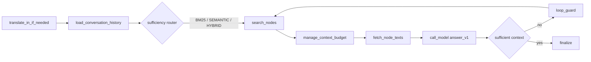

# 🧠 GPU-Accelerated RAG with Weaviate (BYOV) + LLaMA

**Security-aware, local-oriented RAG for code repositories (Weaviate BYOV + LLM via llama.cpp).**

This is a **full-featured RAG server** (retrieval + generation) that can use **external LLMs like any other RAG** — but it is designed to **enforce security policies** and **reduce the risk of accidental data leakage** when working with **classified or restricted content**.

It uses **Weaviate as the single retrieval backend** (vector search + BM25 + hybrid + metadata filtering) with **BYOV (Bring Your Own Vectors)** — embeddings are computed locally and stored in Weaviate. **FAISS is not used anywhere** in this project.

## What “local-oriented” means here

“Local-oriented” does **not** mean “no external LLMs”. It means:

- you can run fully on-prem (GPU) end-to-end,
- you can still route prompts to external providers when allowed,
- and the system can **automatically fall back to an approved local/internal model** when a request touches **classified data**.

In other words: **it behaves like a standard RAG**, but adds **policy enforcement and policy-driven routing** so sensitive contexts are not accidentally sent outside.

## Security policies (built-in)

The system supports **classification-aware generation**:

- retrieved fragments can carry **classification labels** (and other security metadata),
- policies can **block external LLM traffic entirely**, or
- **route generation** to a safe internal/local LLM when a retrieval batch contains content above a configured threshold.

### Why it works well for code analysis

The core optimization for code-repo analysis is that retrieval is not just “top-K chunks”.  
This system is designed to cooperate with a **.NET + SQL code indexer** that produces:

- **structured code fragments** (files / classes / methods / SQL objects) ready for retrieval,
- rich **metadata** for filtering and access control,
- and — most importantly — a **dependency graph** linking fragments.

That graph lets retrieval behave more like a real developer: start from a likely entry point and then **trace dependencies** (callers/callees, type usages, EF links, SQL relationships) to assemble a coherent evidence set. In practice this means the model can “follow the code” instead of guessing based on isolated snippets.

### Not only for code — also for regular documents

Although the system is optimized for code repositories, it can also serve as a RAG backend for typical documents. The difference is that it includes optional mechanisms for **relationship-aware retrieval** (graph expansion and dependency tracing) when the indexed data provides those links.

### Data versioning philosophy: snapshots and snapshot sets

The system’s data model is built around **snapshots** and **snapshot sets**.

- A **snapshot** is a fixed, versioned corpus you query to get **deterministic, repeatable answers** — for example:
  - a specific version of a codebase,
  - or a document set frozen at a specific point in time (e.g., a law as adopted in a given year).

- If you have two versions (e.g., `main` vs `develop`), you are working with **two snapshots**.  
  Likewise, an original law and its amended version are also naturally represented as different snapshots.

- A **snapshot set** groups multiple snapshots into an explicit comparison context.  
  This enables workflows like “compare these two versions”, but the comparison must always be based on **explicit, declared assumptions** (which snapshots, what relationship, what rules) — nothing is implicit or accidental.

---

## Architectural Core Principle: Flexibility

The system is built around dynamic pipelines defined in YAML files.  
You can treat pipelines like building blocks (actions) and assemble them as needed:

- easily change the order of processing steps
- add / disable actions (translation, routing, search, answer generation…)
- define your own prompts, filters, context limits, and policies
- create different work modes (code analysis, UML diagrams, branch comparison)
- reuse and extend existing YAML pipelines via inheritance, eliminating the need to redefine everything from scratch.

Think of it as pipeline composition by configuration, not by code — like configuring a workflow in a YAML file.

**At a glance**



### Pipeline reliability additions

- **Context divider for new retrieval batches:** `manage_context_budget` can insert a one-line marker
  (e.g., `<<<New content`) each time a new batch is appended to `state.context_blocks`. This makes
  “latest evidence” clearly visible to downstream prompts.
- **Sufficiency anti-repeat guard in prompt:** the `sufficiency_router_v1` prompt now includes
  `<<<LAST QUERY>` and `<<<PREVIOUS QUERIES>` injected from pipeline state, and explicitly forbids
  repeating or paraphrasing earlier retrieval queries.

More details, diagrams, and examples are available here:

→ **`docs/`** – full documentation of pipelines, actions, and configuration

### Minimal pipeline example (YAML)

```yaml
YAMLpipeline:
  name: "rejewski"

  settings:
    entry_step_id: "translate"
    behavior_version: "0.2.0"
    compat_mode: locked

  steps:
    - id: "translate"
      action: "translate_in_if_needed"
      next: "load_history"

    - id: "load_history"
      action: "load_conversation_history"
      next: "search"

    - id: "search"
      action: "search_nodes"
      search_type: "hybrid"
      top_k: 8
      next: "fetch"

    - id: "fetch"
      action: "fetch_node_texts"
      top_n_from_settings: "node_text_fetch_top_n"
      next: "answer"

    - id: "answer"
      action: "call_model"
      prompt_key: "rejewski/answer_v1"
      next: "finalize"

    - id: "finalize"
      action: "finalize"
      end: true
```

### Deterministic pipelines across engine versions (compat + lockfile)

The pipeline engine is expected to evolve (new features, new defaults, stricter validation).  
If a pipeline must remain **deterministic and stable regardless of engine upgrades**, it should be run in **compat mode** with a **lockfile**.

- Every pipeline must declare:
  - `settings.behavior_version`
  - `settings.compat_mode`

- When `compat_mode: locked` is enabled, a lockfile must exist next to the YAML:
  - `<pipeline_basename>.lock.json`

The lockfile freezes version-sensitive behavior (defaults, normalization, validation rules, and other implicit semantics captured by the lockfile).

Generate the lockfile:

```bash id="ohhaol"
python -m code_query_engine.pipeline.pipeline_cli lock pipelines/rejewski.yaml
```

### Pipeline inheritance (fast evolution without copy-paste)

Pipelines can **inherit** from other pipelines. This lets you keep a stable base pipeline and create variants by overriding only the parts that change (retrieval strategy, router prompt, filters, limits, policies).

Example: a derived pipeline that reuses the base structure but changes retrieval mode and answer prompt.

**Base pipeline (`pipelines/base/rejewski_base.yaml`)**
```yaml
YAMLpipeline:
  name: "rejewski_base"

  settings:
    entry_step_id: "translate"
    behavior_version: "0.2.0"
    compat_mode: locked

  steps:
    - id: "translate"
      action: "translate_in_if_needed"
      next: "load_history"

    - id: "load_history"
      action: "load_conversation_history"
      next: "search"

    - id: "search"
      action: "search_nodes"
      search_type: "hybrid"
      top_k: 8
      next: "fetch"

    - id: "fetch"
      action: "fetch_node_texts"
      top_n_from_settings: "node_text_fetch_top_n"
      next: "answer"

    - id: "answer"
      action: "call_model"
      prompt_key: "rejewski/answer_v1"
      next: "finalize"

    - id: "finalize"
      action: "finalize"
      end: true
```

**Derived pipeline (`pipelines/rejewski_semantic.yaml`)**
```yaml
YAMLpipeline:
  name: "rejewski_semantic"
  extends: "pipelines/base/rejewski_base.yaml"

  steps:
    - id: "search"
      action: "search_nodes"
      search_type: "semantic_rerank"
      top_k: 12
      next: "fetch"

    - id: "answer"
      action: "call_model"
      prompt_key: "rejewski/answer_semantic_v1"
      next: "finalize"
```

### Access control via pipeline assignment

Assigning users to specific pipelines is not only a UX choice — it is also a practical **access-control mechanism**.

Different pipelines can enforce different constraints:
- which repositories/snapshots a user can query,
- which metadata filters must always apply,
- whether graph expansion is allowed,
- whether external LLM calls are permitted,
- and how classification labels affect routing.

In other words: granting a user access to a pipeline can be used to grant (or deny) access to specific datasets and behaviors.

## **Hardware target.** 
Optimized for a **single NVIDIA RTX 4090** (CUDA 12.x). Defaults (e.g., full llama.cpp CUDA offload) are tuned for a single high-end GPU (e.g., RTX 4090-class).

**Stack focus.**

* **.NET/C# codebases** — deep static analysis via **Roslyn** (ASTs, symbols, references, call graphs) to extract rich, navigable context.
* **SQL & Entity Framework** — inspection of schemas, relationships and query usage to surface domain entities and data access patterns to the RAG layer.
* **Dependency graph of code fragments** — the index stores **links between chunks** (files, classes, methods) so retrieval can traverse relationships (e.g., callers/callees, type usages, EF entity links) and answer questions with proper context.

**Who is this for?** Organizations that **cannot send code to external services** (e.g., banks, financial institutions, operators of critical infrastructure) and must run **fully local** solutions.

---

## Documentation

### Start here (just the local run path)

The `docs/start/` folder contains **only** the step-by-step path to run the project locally (WSL/Linux, GPU, models, Weaviate, server). It is intentionally linear — follow it top-to-bottom.

- `docs/start/00_run_locally.md` — **Start here**: end-to-end local run checklist.
- `docs/start/10_indexing_dotnet_sql.md` — how to index a .NET/SQL codebase (RoslynIndexer) and prepare branches/snapshots.
- `docs/start/30_troubleshooting.md` — common setup/runtime issues (CUDA wheels, Weaviate quirks, etc.).
- `docs/start/40_production.md` — production notes (WSGI, reverse proxy, integrity checks, concurrency).
- `docs/start/50_frontend.md` — frontend notes (single-file dev UI vs production hardening).
- `docs/start/60_integrations_plantuml.md` — PlantUML integration (local Docker server + config).

### Docs map (what lives in each folder)

- `docs/actions/` — action reference docs (inputs/outputs, YAML parameters, behavior contracts).
- `docs/adr/` — architecture decision records (why we chose specific design constraints).
- `docs/contracts/` — pipeline/runtime contracts and invariants (behavior versioning, compat rules, etc.).
- `docs/diagrams/` — architecture/flow diagrams (PlantUML/Mermaid sources and rendered assets).
- `docs/draft/` — work-in-progress notes (not guaranteed to be up-to-date).
- `docs/howto/` — focused “how to” guides for specific workflows (non-linear, task-based).
- `docs/llama.cpt/` — llama.cpp / llama-cpp-python operational notes (model loading, CUDA, tuning).
- `docs/pipeline/` — pipeline authoring docs (YAML structure, inheritance, router patterns, examples).
- `docs/security/` — security model & policies (classification, ACL/filters, external LLM routing rules, auth).
- `docs/sqldb/` — SQL/DB-related docs (schemas, indexing, EF/SQL analysis notes).
- `docs/tests/` — testing strategy and how to run tests locally/CI.
- `docs/use-cases/` — use-case catalog and examples (what the system is meant to solve).
- `docs/weaviate/` — Weaviate setup and operational docs (local compose, schema, tenants/snapshots).

Key entry points:
- Weaviate local setup: `docs/weaviate/weaviate_local_setup.md`
- Pipeline authoring: `docs/pipeline/`
- Action docs: `docs/actions/`
- Security model: `docs/security/`
