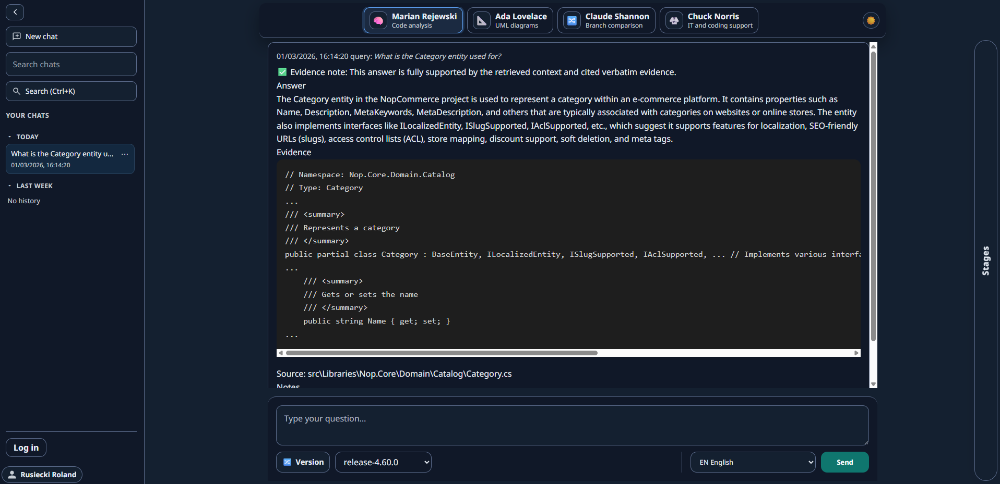
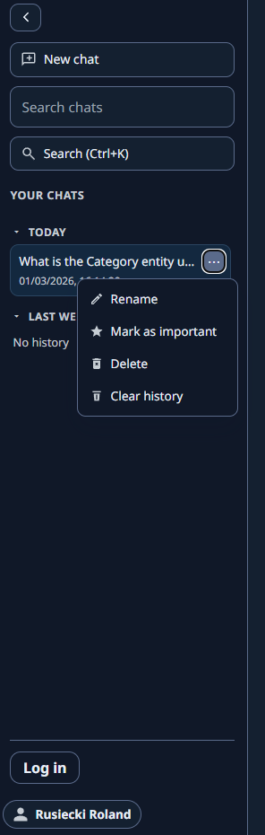
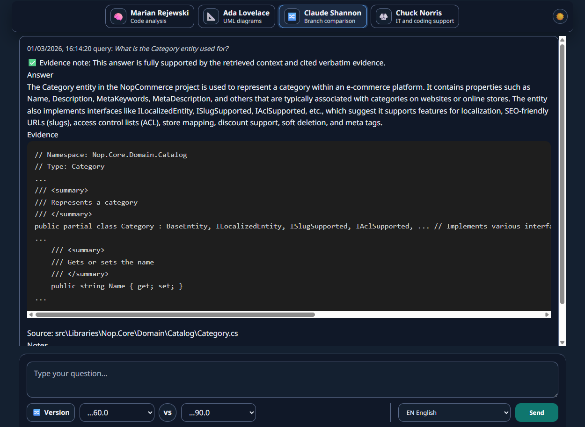
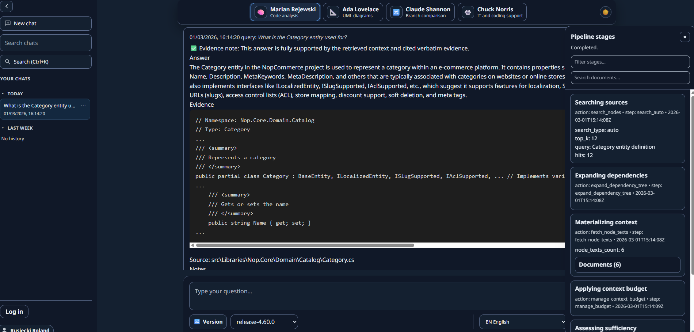
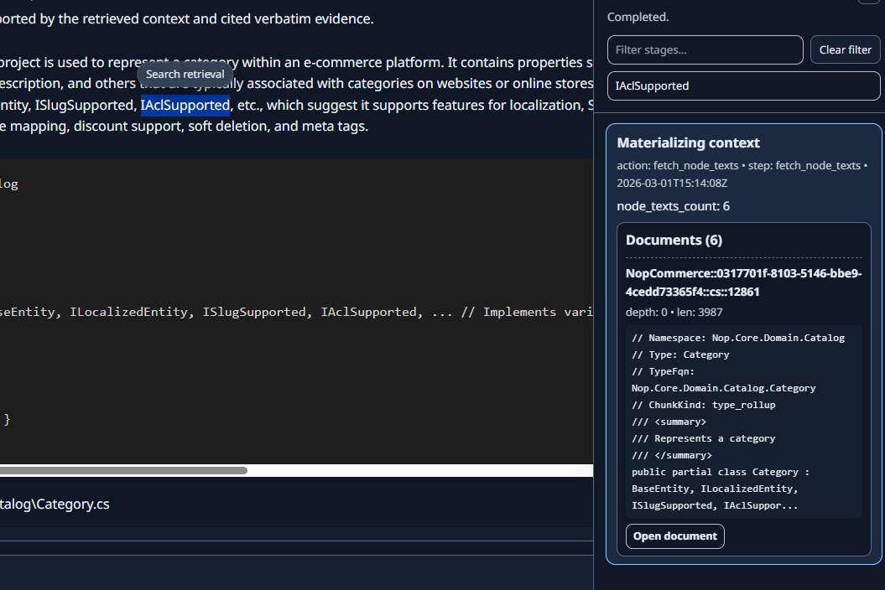
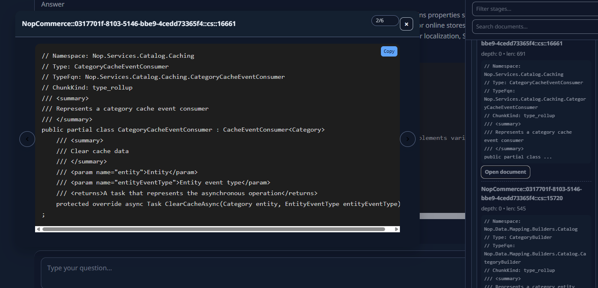

# 03. Web UI guide (EN)

[Home](../Home.md) | [EN](03-Web-UI.md) | [PL](../pl/03-UI-strona.md)

This page documents the main UI features based on the screenshots in `docs/img/`.

## Main layout

The UI is a single-page chat application:
- Left sidebar: chat sessions list, search, and basic actions.
- Top bar: consultant selection (pipelines).
- Center: answer area with evidence/code blocks.
- Bottom: query input and runtime controls (version, language, send).
- Right drawer: pipeline stages and retrieval explorer (when opened).

Screenshot (EN):

## Chat sessions

In the left sidebar you can:
- Start a new chat.
- Search/filter chat sessions.
- Open a previous chat.

Context menu on a chat session provides:
- Rename.
- Mark as important.
- Delete.
- Clear history.

Screenshot (EN):

## Consultants (pipelines)

The top bar shows selectable consultants. Each consultant maps to a backend pipeline.
Typical examples shown in the UI:
- Marian Rejewski: code analysis.
- Ada Lovelace: UML diagrams.
- Claude Shannon: branch/snapshot comparison.
- Chuck Norris: IT/coding support.

The visible consultants are driven by backend configuration (`/app-config`) and permissions.
See: [docs/contracts/frontend_contract.md](../../docs/contracts/frontend_contract.md).

## Version selection and comparison

The bottom bar includes version selection:
- A single version selector for standard queries.
- A comparison mode (two selectors with "VS") for comparing versions/snapshots.

Screenshot (EN):

## Answer and evidence blocks

Answers are displayed with:
- a short summary,
- one or more evidence/code blocks,
- a "Source" line referencing the file/path of the evidence.

The goal is to keep the answer grounded in retrieved evidence.

## Pipeline stages drawer (retrieval explorer)

When the right drawer is opened, you can inspect pipeline execution:
- stages list (completed steps),
- optional filters (filter stages, search documents),
- a documents list (retrieved sources).

Screenshot (EN):

### Look into retrieval

The stages drawer supports inspecting retrieval outputs:
- A per-step view (example: "Materializing context").
- A documents list with quick preview.

Screenshot (EN):

### Document preview

From the documents list you can open a document preview modal:
- Code/text preview with copy button.
- Navigation between documents (e.g. 2/6).

Screenshot (EN):

## Related backend/UI contracts

- [docs/contracts/frontend_contract.md](../../docs/contracts/frontend_contract.md) (frontend integration contract)
- [docs/use-cases/use_cases.md](../../docs/use-cases/use_cases.md) (verified runtime use-cases)
