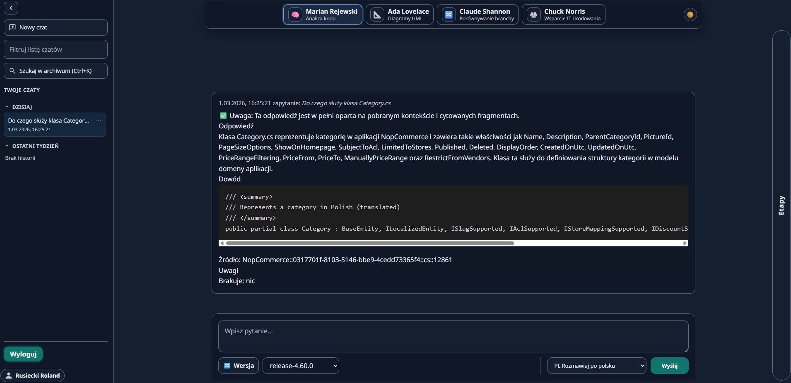
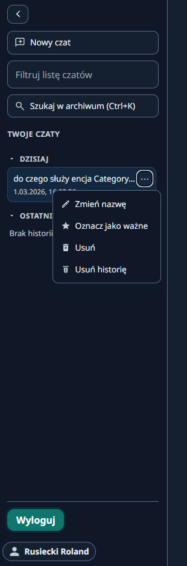
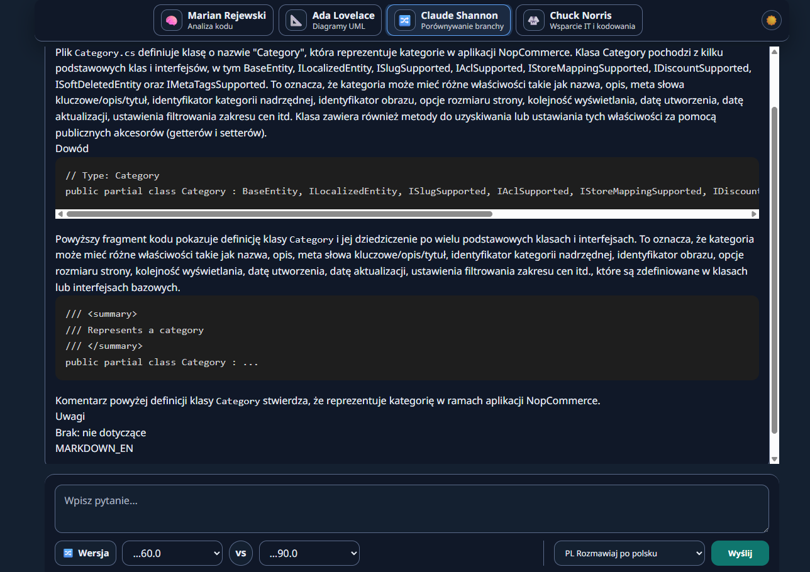
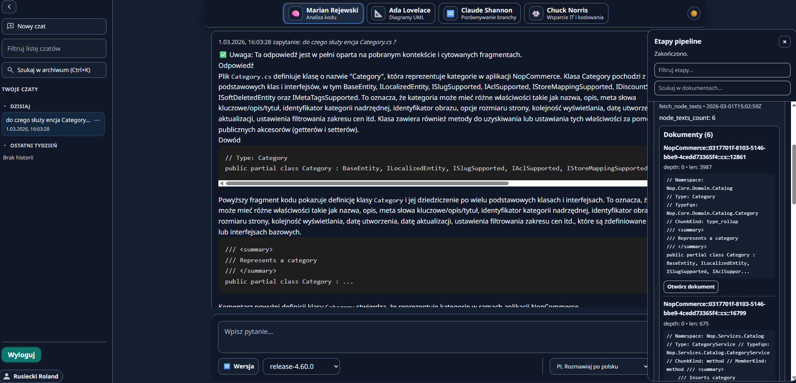
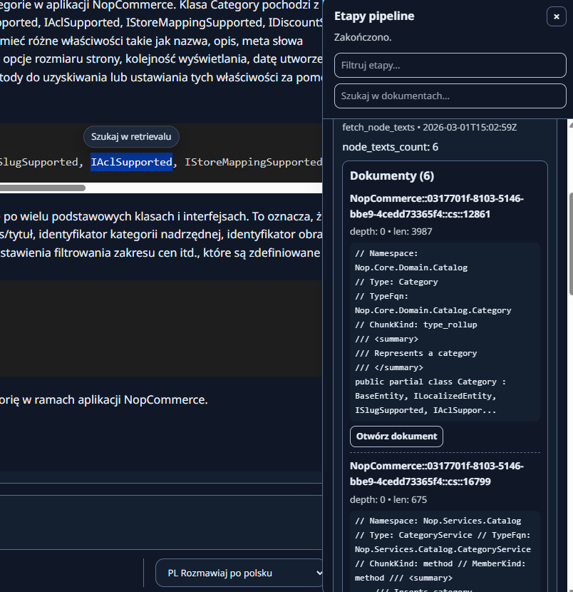
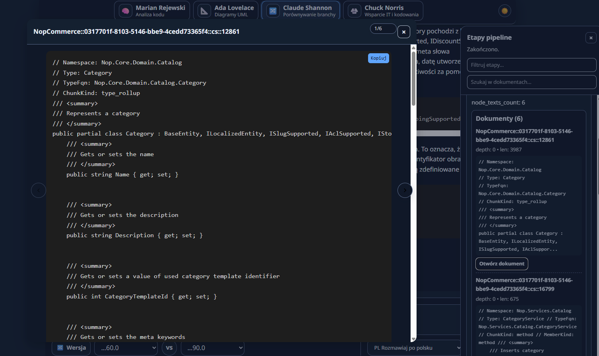

# 03. Przewodnik UI (PL)

[Home](../Home.md) | [EN](../en/03-Web-UI.md) | [PL](03-UI-strona.md)

Ta strona opisuje funkcjonalności UI na podstawie zrzutów ekranu z `docs/img/`.

## Główny układ

UI to aplikacja chat:
- Lewy panel: lista czatów, wyszukiwarka, akcje.
- Góra: wybór konsultanta (pipeline).
- Środek: odpowiedź + dowody (code/evidence).
- Dół: pole pytania + kontrolki runtime (wersja, język, wyślij).
- Prawy drawer: etapy pipeline i explorer retrievalu (po otwarciu).

Zrzut (PL):

## Czat i historia

Menu na czacie (kropki) zawiera:
- Zmień nazwę.
- Oznacz jako ważne.
- Usuń.
- Usuń historię.

Zrzut (PL):

## Wersje i porównanie

Na dole jest wybór wersji:
- tryb pojedynczy (jedna wersja),
- tryb porównania (dwie wersje + "VS").

Zrzut (PL):

## Etapy pipeline i retrieval explorer

Prawy drawer pokazuje:
- etapy wykonania,
- listę dokumentów z retrievalu,
- szybki podgląd i otwieranie dokumentów.

Zrzut (PL):

Zrzut (PL):

Podgląd dokumentu (modal):

## Powiązane kontrakty

- [docs/contracts/frontend_contract.md (EN)](../../docs/contracts/frontend_contract.md)
- [docs/use-cases/use_cases.md (EN)](../../docs/use-cases/use_cases.md)
